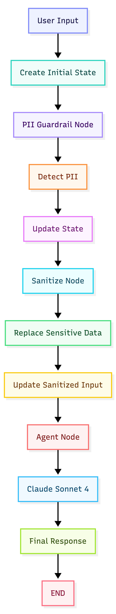
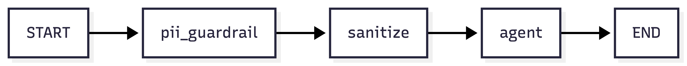
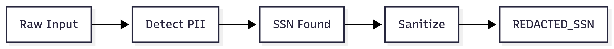
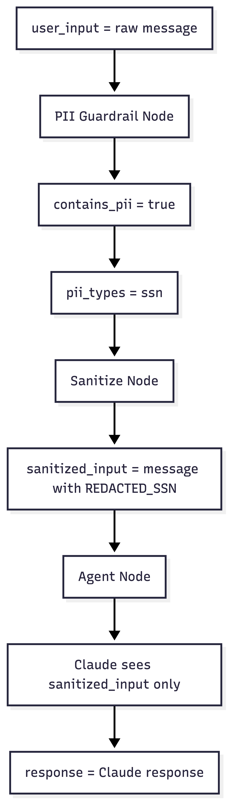
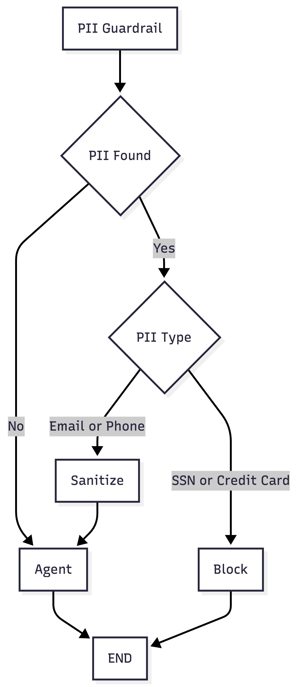

# Agent 01: PII Input Guardrail

## Scenario

A user sends a message to an AI agent.  The message may contain sensitive information.
For example:

```text
My SSN is 123 45 6789. Why was my payment declined?
```

We do not want the language model to receive the real SSN. We first detect the sensitive information. Then we replace it with a safe value.
The model receives only the sanitized message.

## What This Agent Teaches

This agent introduces the basic LangGraph concepts:

1. State
2. Nodes
3. Edges
4. Start
5. End
6. Graph execution

It also introduces our first guardrail concept:

**Input Guardrail**

## Main Flow

<p align="left">
  
</p>

The LangGraph itself is very simple.

<p align="left">
  
</p>

## State

The state is the information shared between all nodes.

```python
class AgentState(TypedDict):
    user_input: str
    sanitized_input: str
    contains_pii: bool
    pii_types: list[str]
    response: str
```

Example initial state:

```python
{
    "user_input": "My SSN is 123-45-6789. Why was my payment declined?",
    "sanitized_input": "",
    "contains_pii": False,
    "pii_types": [],
    "response": ""
}
```

Every node reads the state and can update part of it.

## Node 1: PII Guardrail

The first node checks the user message for sensitive information.

```text
User Input
    |
    v
detect_pii
```

The current version checks for:

1. SSN
2. Credit card
3. Email
4. Phone number

Example input:

```text
My SSN is 123-45-6789.
```

The guardrail detects:

```text
ssn
```

The state becomes:

```python
{
    "contains_pii": True,
    "pii_types": ["ssn"]
}
```

The original user input is still available inside the application. It is not sent to Claude.

## Node 2: Sanitize

The next node removes the sensitive value.

Example:

```text
My SSN is 123-45-6789.
```

becomes:

```text
My SSN is [REDACTED_SSN].
```

This sanitized message is stored in:

```python
state["sanitized_input"]
```

The flow looks like this:

<p align="left">
  
</p>

## Node 3: Agent

The agent node calls Claude Sonnet 4.

The model must receive only:

```python
state["sanitized_input"]
```

It must not receive:

```python
state["user_input"]
```

The model is created using:

```python
from langchain_anthropic import ChatAnthropic

model = ChatAnthropic(
    model="claude-sonnet-4-20250514"
)
```

We keep the system instruction and user message separate.

```python
response = model.invoke([
    SystemMessage(
        content="You are a helpful customer support assistant."
    ),
    HumanMessage(
        content=state["sanitized_input"]
    )
])
```

The system message tells Claude what role it should perform. The human message contains the sanitized user request.

## Complete Example

Original input:

```text
My SSN is 123-45-6789. Why was my payment declined?
```

PII detection:

```text
Contains PII: True
PII Types: ["ssn"]
```

Sanitized input:

```text
My SSN is [REDACTED_SSN]. Why was my payment declined?
```

Only this sanitized input is sent to Claude.

## State Flow

<p align="left">
  
</p>

## Important Idea

Detection and sanitization are two different responsibilities. Detection answers:

```text
Does the message contain sensitive information?
```

Sanitization answers:

```text
What should we do with that sensitive information?
```

In this version, we replace sensitive information. Later we may use different policies.

For example:

```text
Email      -> Redact

Phone      -> Redact

SSN        -> Block

Credit Card -> Block
```

## What LangGraph Is Doing

LangGraph is not detecting the PII.

LangGraph is not sanitizing the PII.

LangGraph is coordinating the flow.

```text
State
  |
  v
Node
  |
  v
State Update
  |
  v
Next Node
```

Our Python functions contain the actual logic. LangGraph decides how those functions are connected.

## Current Graph

The current graph always follows the same path.

```text
START
  |
  v
PII Guardrail
  |
  v
Sanitize
  |
  v
Agent
  |
  v
END
```

There is no conditional routing yet. Even when no PII exists, the request still goes through the sanitize node.

## Next Step

The next version will introduce conditional routing.

The graph will decide what to do based on the detected information.

<p align="left">
  
</p>

This will introduce one of the most important LangGraph concepts:

**Conditional Edges**