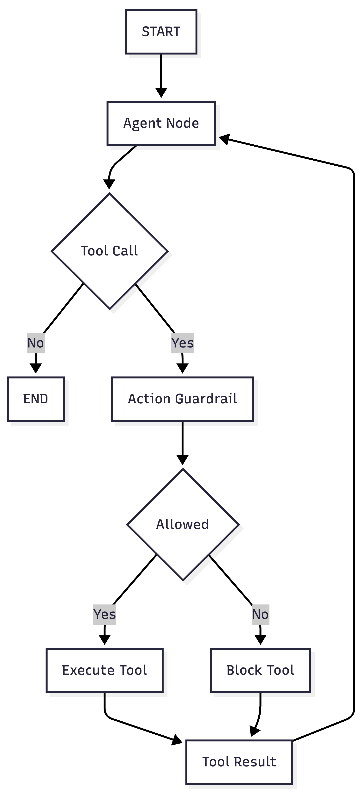
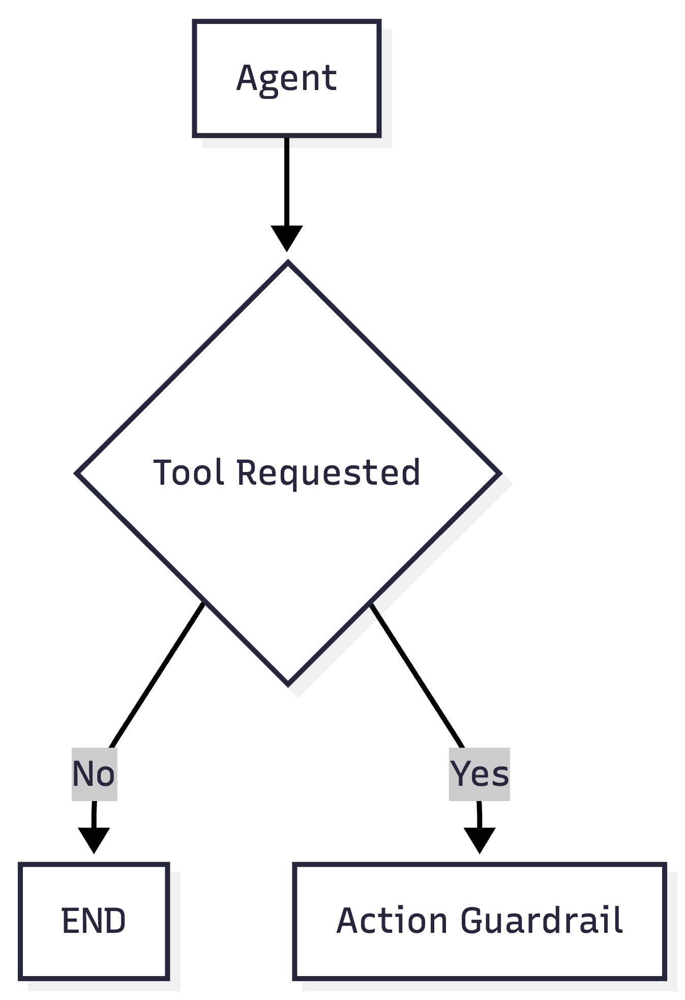
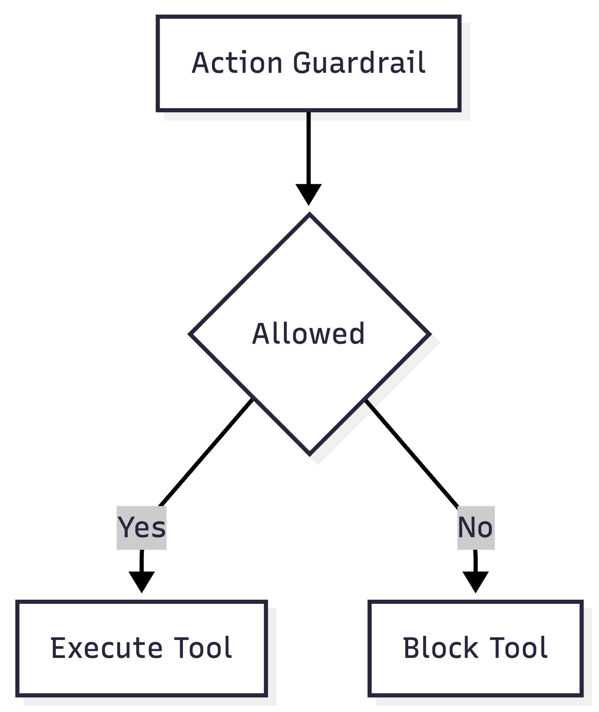
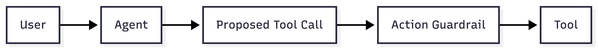
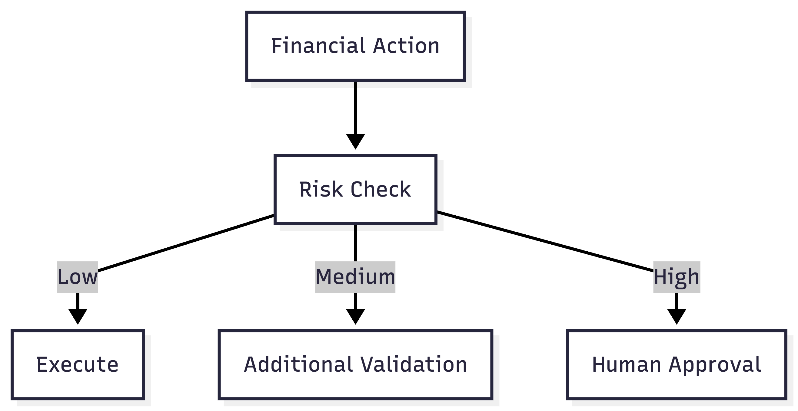

# Agent 02: Financial Action Guardrail

## Scenario

A user asks the AI agent to issue a refund.

For example:

```text
Please refund $200 for invoice INV 1001.
```

The agent can decide that the refund tool should be called.

But the agent should not be allowed to execute every refund automatically.

Before the refund tool runs, an action guardrail checks whether the action is allowed.

## What This Agent Teaches

This agent introduces:

1. Tool calling
2. ReAct style flow
3. Conditional routing
4. Action guardrails
5. Tool authorization
6. Safe financial actions

## Main Idea

The model can propose an action.

The guardrail decides whether the action is allowed.

The tool runs only after approval.

```text
LLM proposes
     |
     v
Guardrail checks
     |
     v
Application executes
```

## Main Graph

<p align="left">
  
</p>

## Nodes

### Agent Node

The agent node sends the conversation to Claude Sonnet 4.

Claude can either:

1. Answer the user directly
2. Propose a tool call

Example tool call:

```text
issue_refund

invoice_id = INV 1001
amount = 200
```

At this point, the refund has not happened yet.

Claude has only proposed the action.

## Action Guardrail Node

The action guardrail checks the proposed tool call.

For example:

```text
Tool: issue_refund
Amount: 200
```

The current rules are simple:

```text
Amount less than or equal to 500
ALLOW

Amount greater than 500
BLOCK

Amount less than or equal to 0
BLOCK
```

The guardrail returns:

```text
allowed = true
```

or:

```text
allowed = false
```

It also returns a reason.

## Execute Tool Node

This node runs only when the action guardrail allows the action.

For example:

```text
Refund of $200 issued for invoice INV 1001.
```

The tool result is then returned to the agent.

## Block Tool Node

This node runs when the guardrail rejects the action.

The refund tool is not executed.

Instead, the agent receives a message such as:

```text
Refund was not executed.

Reason:
Refunds above $500 require additional approval.
```

Claude can then explain the result to the user.

## Why Conditional Edges Are Used

Agent 01 followed the same path every time.

Agent 02 does not.

After the agent runs, we need to decide:

```text
Did Claude request a tool?
```

If no:

```text
END
```

If yes:

```text
Action Guardrail
```

This requires conditional routing.

<p align="left">
  
</p>

We also need another decision after the guardrail.

```text
Was the action allowed?
```

<p align="left">
  
</p>

This is why `add_conditional_edges` is used.

The next node depends on what happened at runtime.

## State

This agent stores the conversation in `messages`.

```python
class AgentState(TypedDict):
    messages: Annotated[list[AnyMessage], add_messages]

    tool_name: str
    tool_args: dict

    action_allowed: bool
    guardrail_reason: str
```

The state also stores information about the proposed action.

For example:

```text
tool_name = issue_refund

tool_args =
{
    invoice_id: INV 1001,
    amount: 200
}

action_allowed = true

guardrail_reason =
Refund is within the allowed limit.
```

## Why We Use Messages

Agent 01 used simple strings.

This agent keeps a conversation history.

For example:

```text
Human Message
     |
     v
AI Message with Tool Call
     |
     v
Tool Message
     |
     v
AI Final Response
```

This is important because Claude needs to see the tool result before giving the final answer.

## ReAct Style Flow

This agent follows a simple ReAct style pattern.

```text
Reason
  |
  v
Act
  |
  v
Observe
  |
  v
Reason Again
```

In our example:

```text
User asks for refund
        |
        v
Claude decides refund tool is needed
        |
        v
Action Guardrail checks the request
        |
        v
Refund tool executes
        |
        v
Claude sees the result
        |
        v
Claude answers the user
```

The guardrail is inserted before the action is executed.

## Example 1

User:

```text
Please refund $200 for invoice INV 1001.
```

Claude proposes:

```text
issue_refund

amount = 200
```

Guardrail:

```text
200 <= 500
```

Decision:

```text
ALLOW
```

Tool runs:

```text
Refund of $200 issued.
```

Claude returns the final answer.

## Example 2

User:

```text
Please refund $700 for invoice INV 1001.
```

Claude proposes:

```text
issue_refund

amount = 700
```

Guardrail:

```text
700 > 500
```

Decision:

```text
BLOCK
```

The refund function is not executed.

Claude receives:

```text
Refund was not executed.

Refunds above $500 require additional approval.
```

Claude then explains this to the user.

## Important Idea

Tool selection and tool authorization are different things.

Claude may select:

```text
issue_refund
```

But Claude does not decide whether the refund is allowed.

The guardrail decides that.

```text
Agent selects
     |
     v
Guardrail authorizes
     |
     v
Application executes
```

## What LangGraph Is Doing

LangGraph is coordinating the execution flow.

It connects:

```text
Agent
Action Guardrail
Execute Tool
Block Tool
```

It also decides which path should run using conditional edges.

The financial policy itself is implemented inside `guardrail.py`.

## Guardrail Placement

The action guardrail sits between the agent and the tool.

<p align="left">
  
</p>

This placement is important.

The tool must never execute before the action guardrail has checked the request.

## Current Limitation

The current guardrail uses only a simple refund amount rule.

Real financial guardrails may also check:

1. Customer identity
2. Agent permissions
3. Account status
4. Daily limits
5. Refund history
6. Fraud signals
7. Transaction risk
8. Human approval

These controls will be added in later agents.

## What We Learned

From the agent side:

```text
Tool calling
Messages
ReAct
Conditional edges
Agent loop
```

From the guardrail side:

```text
Action validation
Financial limits
Allow decision
Block decision
Safe tool execution
```

## Next Step

The next agent will introduce risk based routing.

Instead of only:

```text
ALLOW
BLOCK
```

we will begin to think in terms of:

```text
LOW RISK

MEDIUM RISK

HIGH RISK
```

Different risk levels can follow different paths.

For example:

<p align="left">
  
</p>