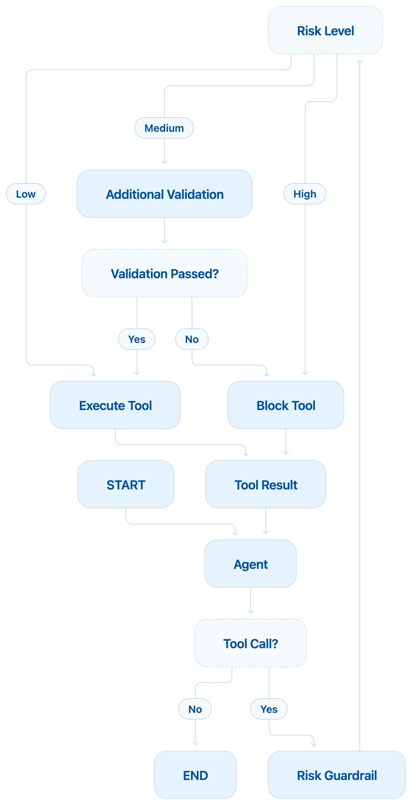

# Agent 03: Financial Risk Routing

## Scenario

A user asks the agent to issue a refund.

The agent can propose the refund tool.

Before the refund runs, the action is checked for risk.

This agent does not use only allow or block.

It classifies the action as:

```text
LOW

MEDIUM

HIGH
```

Different risk levels follow different paths.

## What This Agent Teaches

This agent introduces:

1. Risk based action guardrails
2. Conditional routing
3. Low risk actions
4. Medium risk actions
5. High risk actions
6. Additional validation
7. Different execution paths

## Guardrail Type

This is an **Action Guardrail**.

More specifically, it is a:

**Risk Based Action Guardrail**

It sits between the agent and the financial tool.

```text
User
  |
  v
Agent
  |
  v
Proposed Tool Call
  |
  v
Risk Guardrail
  |
  v
LOW / MEDIUM / HIGH
```

## Main Idea

Agent 02 used:

```text
ALLOW
BLOCK
```

Agent 03 uses:

```text
LOW
MEDIUM
HIGH
```

This gives us more control.

For example:

```text
Low Risk
   |
   v
Execute

Medium Risk
   |
   v
Additional Validation
   |
   v
Execute or Block

High Risk
   |
   v
Block
```

## Main Flow

<p align="center">
  
</p>

The graph can also be understood like this:

```text
START
  |
  v
Agent
  |
  v
Tool Call?
 /      \
No      Yes
|        |
END      v
      Risk Guardrail
           |
           v
      Risk Level?
      /    |    \
    Low  Medium  High
     |      |      |
     v      v      v
 Execute Validate Block
            |
            v
      Validation Passed?
          /      \
        Yes      No
         |        |
         v        v
      Execute    Block
```

## Risk Rules

For learning, the rules are simple.

```text
$1 to $100
LOW RISK
Execute directly

$101 to $500
MEDIUM RISK
Run additional validation

Above $500
HIGH RISK
Block
```

These are only sample rules for learning.

Real financial systems may use many more signals.

## State

The state stores the conversation and the current risk information.

```python
class AgentState(TypedDict):
    messages: Annotated[list[AnyMessage], add_messages]

    tool_name: str
    tool_args: dict

    risk_level: str
    guardrail_reason: str

    validation_passed: bool
    validation_reason: str
```

Example:

```text
tool_name = issue_refund

tool_args =
{
    invoice_id: INV-1001,
    amount: 300
}

risk_level = medium

guardrail_reason =
Refund requires additional validation.
```

## Node 1: Agent

The agent reads the user request.

Example:

```text
Please refund $300 for invoice INV-1001.
```

Claude may propose:

```text
issue_refund

invoice_id = INV-1001
amount = 300
```

The refund has not happened yet.

The tool call is only a proposal.

## Node 2: Risk Guardrail

The risk guardrail checks the proposed action.

It looks at:

```text
Tool name

Tool arguments

Refund amount
```

Then it assigns a risk level.

For example:

```text
Refund amount = $50
Risk = LOW
```

or:

```text
Refund amount = $300
Risk = MEDIUM
```

or:

```text
Refund amount = $900
Risk = HIGH
```

## Node 3: Additional Validation

This node runs only for medium risk actions.

In the current version it checks:

```text
Is the invoice ID present?

Does the invoice ID start with INV?
```

For example:

```text
INV-1001
```

passes.

But:

```text
ABC-1001
```

fails.

Later this node can perform real business checks such as:

1. Does the invoice exist
2. Was the invoice already refunded
3. Does the refund amount match the payment
4. Is the customer authorized
5. Is the account active

## Node 4: Execute Tool

This node runs the actual refund.

It can be reached in two ways.

Low risk:

```text
LOW
  |
  v
Execute Tool
```

Medium risk:

```text
MEDIUM
   |
   v
Additional Validation
   |
   v
Passed
   |
   v
Execute Tool
```

The refund should never execute before the guardrail path is complete.

## Node 5: Block Tool

This node is used when the action should not run.

For example:

```text
HIGH RISK
   |
   v
BLOCK
```

The tool is not executed.

Instead, the agent receives a message such as:

```text
Refund was not executed.

Reason:
Refund requires human approval.
```

Claude can then explain that result to the user.

## Why Conditional Edges Are Important

The graph does not always follow the same path.

After the risk guardrail runs, the next node depends on the risk level.

Conceptually:

```python
if risk == LOW:
    execute

elif risk == MEDIUM:
    validate_more

else:
    block
```

LangGraph represents these paths using conditional edges.

This makes the graph easier to understand and easier to extend.

## Low Risk Example

User:

```text
Refund $50 for invoice INV-1001.
```

Claude proposes:

```text
issue_refund

amount = 50
```

Risk guardrail:

```text
LOW
```

Flow:

```text
Agent
  |
  v
Risk Guardrail
  |
  v
LOW
  |
  v
Execute Tool
```

## Medium Risk Example

User:

```text
Refund $300 for invoice INV-1001.
```

Risk guardrail:

```text
MEDIUM
```

Flow:

```text
Agent
  |
  v
Risk Guardrail
  |
  v
MEDIUM
  |
  v
Additional Validation
  |
  v
Validation Passed
  |
  v
Execute Tool
```

## High Risk Example

User:

```text
Refund $900 for invoice INV-1001.
```

Risk guardrail:

```text
HIGH
```

Flow:

```text
Agent
  |
  v
Risk Guardrail
  |
  v
HIGH
  |
  v
Block Tool
```

The refund is not executed.

## Important Idea

Risk should change how the system behaves.

A low risk action may execute directly.

A medium risk action may require additional checks.

A high risk action may require human approval.

```text
Same Tool

Different Risk

Different Path
```

This is more realistic than using only allow or block.

## What LangGraph Is Doing

LangGraph coordinates:

```text
Agent

Risk Guardrail

Additional Validation

Execute Tool

Block Tool
```

Conditional edges decide which node runs next.

The financial policy itself lives inside `guardrail.py`.

## What We Learned

From the agent side:

```text
Tool calling

Messages

Conditional routing

Multiple execution paths

Agent loop
```

From the guardrail side:

```text
Risk classification

Low risk handling

Medium risk validation

High risk blocking

Financial action control
```

## Current Limitation

High risk actions are currently blocked.

A real system may not want to simply block every high risk request.

It may ask a human for approval.

That is the next step.

## Next Step

Agent 04 will introduce:

**Human in the Loop**

Instead of:

```text
HIGH
  |
  v
BLOCK
```

we will move toward:

```text
HIGH
  |
  v
Pause
  |
  v
Human Approval
  |
  v
Approve or Reject
  |
  v
Resume
```

This will teach how LangGraph can pause and resume an agent workflow safely.