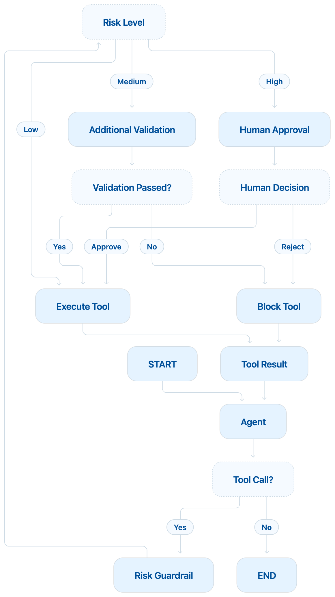

# Agent 04: Human Approval for High Risk Financial Actions

## Scenario

A user asks the agent to issue a refund.

The agent proposes the refund tool.

The financial guardrail checks the risk.

If the refund is high risk, the system does not execute it immediately.

Instead, the graph pauses and asks a human for approval.

## What This Agent Teaches

This agent introduces:

1. Human in the loop
2. High risk action approval
3. LangGraph interrupt
4. Checkpointing
5. Thread ID
6. Pause and resume
7. Safe financial execution

## Guardrail Type

This is an **Action Guardrail**.

More specifically, it is a:

**Human Approval Guardrail**

It sits between the proposed financial action and the actual tool execution.

```text
User
  |
  v
Agent
  |
  v
Proposed Refund
  |
  v
Risk Guardrail
  |
  v
HIGH RISK
  |
  v
Human Approval
  |
  v
Approve or Reject
```

## Main Idea

Agent 03 handled high risk actions like this:

```text
HIGH
  |
  v
BLOCK
```

Agent 04 changes that behavior.

```text
HIGH
  |
  v
PAUSE
  |
  v
HUMAN APPROVAL
  |
  v
APPROVE OR REJECT
```

This is more realistic.

Some actions should not be automatically blocked.

They should be reviewed by a human.

## Main Flow

<p align="center">
  
</p>

The graph can also be understood like this:

```text
START
  |
  v
Agent
  |
  v
Tool Call?
 /      \
No      Yes
|        |
END      v
      Risk Guardrail
          |
          v
      Risk Level?
      /    |    \
    Low  Medium  High
     |      |      |
     v      v      v
 Execute Validate Human Approval
            |          |
            v          v
       Passed?      Approve?
        /   \        /    \
      Yes   No     Yes    No
       |     |      |      |
       v     v      v      v
    Execute Block Execute Block
```

## Risk Rules

For learning, the rules are:

```text
$1 to $100
LOW RISK
Execute directly

$101 to $500
MEDIUM RISK
Run additional validation

Above $500
HIGH RISK
Require human approval
```

## State

The state contains the conversation and the guardrail information.

```python
class AgentState(TypedDict):
    messages: Annotated[list[AnyMessage], add_messages]

    tool_name: str
    tool_args: dict

    risk_level: str
    guardrail_reason: str

    validation_passed: bool
    validation_reason: str

    human_approved: bool
```

For example:

```text
tool_name = issue_refund

tool_args =
{
    invoice_id: INV-1001,
    amount: 900
}

risk_level = high

guardrail_reason =
Refund requires human approval.

human_approved = false
```

## Node 1: Agent

The agent reads the user request.

Example:

```text
Please refund $900 for invoice INV-1001.
```

Claude may propose:

```text
issue_refund

invoice_id = INV-1001
amount = 900
```

The refund has not happened yet.

The tool call is only a proposal.

## Node 2: Risk Guardrail

The risk guardrail checks the proposed financial action.

For a $900 refund:

```text
Amount = 900

Risk = HIGH
```

The graph now routes the request to human approval.

## Node 3: Human Approval

This node asks a human to review the action.

It uses:

```python
interrupt(...)
```

Example:

```python
decision = interrupt(
    {
        "question": "Approve this refund?",
        "tool": state["tool_name"],
        "arguments": state["tool_args"],
        "risk_level": state["risk_level"],
        "reason": state["guardrail_reason"],
    }
)
```

When LangGraph reaches `interrupt`, the graph pauses.

The refund tool has still not executed.

## Pause

At this point:

```text
Agent
  |
  v
Risk Guardrail
  |
  v
HIGH
  |
  v
Human Approval
  |
  v
PAUSED
```

The graph waits for a human decision.

## Human Decision

The reviewer can approve or reject.

Example:

```text
Approve this refund?

Invoice:
INV-1001

Amount:
$900

Risk:
HIGH
```

The human responds:

```text
yes
```

or:

```text
no
```

## Resume

The graph resumes using:

```python
Command(resume=True)
```

or:

```python
Command(resume=False)
```

If the human approves:

```text
Human Approval
      |
      v
Approved
      |
      v
Execute Tool
```

If the human rejects:

```text
Human Approval
      |
      v
Rejected
      |
      v
Block Tool
```

## Checkpointing

The graph needs to remember its state while it is paused.

For learning, we use:

```python
checkpointer = MemorySaver()
```

Then:

```python
graph = builder.compile(
    checkpointer=checkpointer
)
```

The checkpointer remembers information such as:

```text
Messages

Tool name

Tool arguments

Risk level

Guardrail reason

Current graph position
```

Without saved state, the graph would not know how to continue later.

## Thread ID

We also use:

```python
config = {
    "configurable": {
        "thread_id": "refund-001"
    }
}
```

The thread ID identifies a specific graph execution.

Think of it as:

```text
Which paused refund request are we talking about?
```

When we resume the graph, we use the same thread ID.

This allows LangGraph to load the correct saved state.

## Example 1: Human Approves

User:

```text
Please refund $900 for invoice INV-1001.
```

Claude proposes:

```text
issue_refund

amount = 900
```

Risk:

```text
HIGH
```

The graph pauses.

Human:

```text
yes
```

Flow:

```text
HIGH
  |
  v
Human Approval
  |
  v
Approved
  |
  v
Execute Tool
  |
  v
Refund Issued
```

Claude can then tell the user that the refund succeeded.

## Example 2: Human Rejects

User:

```text
Please refund $900 for invoice INV-1001.
```

Risk:

```text
HIGH
```

The graph pauses.

Human:

```text
no
```

Flow:

```text
HIGH
  |
  v
Human Approval
  |
  v
Rejected
  |
  v
Block Tool
```

The refund is not executed.

Claude can then explain that the request was not approved.

## Why Human Approval Matters

LLMs should not have unlimited authority over sensitive financial actions.

A model may propose an action.

That does not mean the action should automatically happen.

The safer pattern is:

```text
Agent proposes
      |
      v
Guardrail checks risk
      |
      v
Human approves high risk actions
      |
      v
Application executes
```

## Important Design Rule

The human approval node should not perform the financial action.

Its only job is to ask for approval.

```text
Human Approval Node
        |
        v
No Financial Side Effect
```

The actual refund happens only inside:

```text
Execute Tool Node
```

This keeps approval and execution separate.

## Why This Separation Matters

When a graph resumes after an interrupt, the interrupted node may run again from the beginning.

Therefore, important side effects should not happen before the interrupt.

Good design:

```text
Human Approval
      |
      v
Interrupt
      |
      v
Approve
      |
      v
Execute Tool
```

Bad design:

```text
Issue Refund
     |
     v
Interrupt
```

The financial action must happen only after approval.

## What LangGraph Is Doing

LangGraph coordinates:

```text
Agent

Risk Guardrail

Additional Validation

Human Approval

Execute Tool

Block Tool
```

It also stores the paused state and resumes the graph later.

## What We Learned

From the agent side:

```text
Interrupt

Pause

Resume

Checkpointing

Thread ID

Human in the loop
```

From the guardrail side:

```text
High risk review

Manual approval

Separation of duties

Safe financial execution
```

## Current Limitation

The human approval step currently uses simple console input.

For example:

```text
Approve refund? yes/no:
```

In a real system, approval may happen through:

```text
Web UI

Admin portal

Slack

Teams

Email

Workflow system
```

The LangGraph concept stays the same.

The graph pauses.

A human reviews the request.

The decision resumes the graph.

## Evolution So Far

Agent 01:

```text
Protect the model input
```

Agent 02:

```text
Validate actions before tools
```

Agent 03:

```text
Route actions based on risk
```

Agent 04:

```text
Ask a human before executing high risk actions
```

## Next Step

Agent 05 will introduce a different guardrail area:

**Memory Guardrail**

The main question will be:

```text
The agent is allowed to see this information.

But should the agent be allowed to remember it?
```

For example:

```text
Customer name
Maybe store

Preferred language
Maybe store

SSN
Do not store

Credit card number
Do not store
```

This will introduce privacy controls around agent memory.