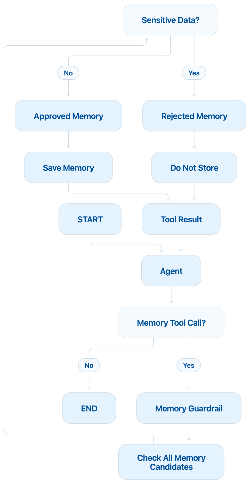

# Agent 05: Memory Guardrail / Sensitive Data Retention Guardrail

## Scenario

A user asks the agent to remember useful information. For example:

```text
Please remember that my preferred language is English
and my SSN is 123-45-6789.
```

The agent may decide that both pieces of information could be stored. But they should not be treated the same way.

The preferred language is safe to remember. The SSN is sensitive and should not be stored in long term memory.

## What This Agent Teaches

This agent introduces:

1. Memory guardrails
2. Long term memory safety
3. Sensitive data retention rules
4. Multiple tool calls
5. Memory candidates
6. Approved memories
7. Rejected memories
8. Safe persistence

## Guardrail Type

This is a **Memory Guardrail**.

More specifically, it is a:

**Sensitive Data Retention Guardrail**

The guardrail sits between the agent and the memory store.

```text
User
  |
  v
Agent
  |
  v
Memory Candidate
  |
  v
Memory Guardrail
  |
  +------ Safe ------> Store
  |
  +------ Sensitive -> Do Not Store
```

## Main Idea

The agent may see some information during the current conversation. That does not mean the information should be saved for future conversations.
The main question is:

```text
Should this information be stored?
```

For example:

```text
Preferred language
        |
        v
       Safe
        |
        v
      Store
```

But:

```text
SSN
 |
 v
Sensitive
 |
 v
Do Not Store
```

## Main Flow

<p align="center">
  
</p>

The flow can also be understood like this:

```text
START
  |
  v
Agent
  |
  v
Memory Tool Call?
 /        \
No        Yes
|          |
END        v
      Memory Guardrail
            |
            v
      Check Every Memory
        /           \
      Safe        Sensitive
       |              |
       v              v
     Store          Reject
        \            /
         \          /
          v        v
        Tool Results
            |
            v
           Agent
            |
            v
           END
```

## Example Input

```text
Please remember that my preferred language is English
and my SSN is 123-45-6789.
```

Claude may propose two memory tool calls.

```text
save_memory

key = preferred_language
value = English
```

and:

```text
save_memory

key = ssn
value = 123-45-6789
```

The guardrail evaluates each memory separately.

## Safe Memory

For:

```text
preferred_language = English
```

the guardrail checks the value.

No sensitive information is detected.

Decision:

```text
ALLOW
```

The memory is stored.

```text
preferred_language = English
```

## Sensitive Memory

For:

```text
ssn = 123-45-6789
```

the guardrail detects:

```text
SSN
```

Decision:

```text
BLOCK
```

The SSN is not stored.

## Final Memory

The final memory store should contain:

```python
{
    "preferred_language": "English"
}
```

It should not contain:

```python
{
    "ssn": "123-45-6789"
}
```

## State

The state stores the conversation and the memory decisions.

```python
class AgentState(TypedDict):

    messages: Annotated[
        list[AnyMessage],
        add_messages
    ]

    memory_candidates: list[dict]

    approved_memories: list[dict]

    rejected_memories: list[dict]
```

## Memory Candidates

The agent may propose more than one memory.

For example:

```text
Memory Candidate 1

key = preferred_language
value = English
```

```text
Memory Candidate 2

key = ssn
value = 123-45-6789
```

Both are sent to the memory guardrail.

## Approved Memories

Safe values are added to:

```python
approved_memories
```

For example:

```text
preferred_language = English
```

## Rejected Memories

Sensitive values are added to:

```python
rejected_memories
```

For example:

```text
ssn = 123-45-6789
```

The reason is also stored.

```text
Sensitive data must not be stored.
```

## Memory Guardrail Node

The memory guardrail checks every proposed memory.

The code uses:

```python
for tool_call in last_message.tool_calls:
```

This is important.

The agent may propose multiple memory tool calls in one response.

Each one must be evaluated separately.

The guardrail decides:

```text
ALLOW
```

or:

```text
BLOCK
```

for every memory candidate.

## Why Multiple Tool Calls Matter

The user gave two facts:

```text
Preferred language = English

SSN = 123-45-6789
```

Claude may create two tool calls.

If we only process:

```python
tool_calls[0]
```

we may ignore the second memory.

Instead, we process all tool calls.

```text
Agent
  |
  v
Multiple Memory Candidates
   /                  \
  /                    \
English                SSN
  |                     |
  v                     v
Guardrail            Guardrail
  |                     |
  v                     v
ALLOW                 BLOCK
  |                     |
  v                     v
STORE               DO NOT STORE
```

## Memory Store

For learning, the current version uses:

```python
MEMORY_STORE = {}
```

This is only a simple Python dictionary.

For example:

```python
{
    "preferred_language": "English"
}
```

This is not production memory.

In a real system, memory may be stored in:

```text
Database

Redis

DynamoDB

PostgreSQL

Vector Store

LangGraph Store
```

The guardrail principle stays the same.

## Important Difference From Agent 01

Agent 01 protected the model input.

```text
Sensitive Input
      |
      v
Input Guardrail
      |
      v
Sanitize
      |
      v
LLM
```

The question was:

```text
Should the LLM see this information?
```

Agent 05 protects memory.

```text
Information
     |
     v
Agent
     |
     v
Memory Candidate
     |
     v
Memory Guardrail
```

The question is:

```text
Should this information be remembered?
```

These are two different security controls.

## Important Design Rule

The model should not control retention policy.

Claude may propose:

```text
Save this information.
```

But the application decides:

```text
Is this information allowed in memory?
```

The pattern is:

```text
Model proposes
      |
      v
Guardrail decides
      |
      v
System stores
```

This is the same safe pattern we used for financial actions.

## Example Flow

```text
User

"Remember that my preferred language is English
and my SSN is 123-45-6789."

        |
        v

Agent

        |
        v

Two Memory Candidates

        |
        +-------------------------+
        |                         |
        v                         v

preferred_language               ssn
English                          123-45-6789

        |                         |
        v                         v

Memory Guardrail            Memory Guardrail

        |                         |
        v                         v

ALLOW                     Sensitive Data Found

        |                         |
        v                         v

STORE                       BLOCK
```

## Sensitive Data Checked

The current guardrail checks for:

1. SSN
2. Credit card number
3. Email
4. Phone number

These are simple learning rules.

A real memory policy may also consider:

1. Health information
2. Financial information
3. Authentication data
4. Account numbers
5. Secrets
6. Tokens
7. Passwords
8. Company confidential data

## What We Learned

From the agent side:

```text
Multiple tool calls

Messages

Tool results

Agent loop

Memory tool
```

From the guardrail side:

```text
Memory policy

Sensitive data detection

Retention control

Approved memory

Rejected memory
```

## Main Learning

An agent being allowed to see information does not automatically mean it should be allowed to remember it.

```text
Can See
   does not mean
Can Store
```

That is the key idea behind a memory guardrail.

## Evolution So Far

Agent 01:

```text
Protect model input
```

Agent 02:

```text
Protect tool execution
```

Agent 03:

```text
Route financial actions by risk
```

Agent 04:

```text
Require human approval for high risk actions
```

Agent 05:

```text
Protect long term memory
```

## Next Step

Agent 06 will move into another important area:

**Retrieval Guardrails**

The main question will become:

```text
The agent retrieved this document.

Should the agent trust it?
```

We will work with:

```text
Access control

Indirect prompt injection

Document trust

Retrieved content validation
```

This will connect guardrails with RAG and retrieval systems.