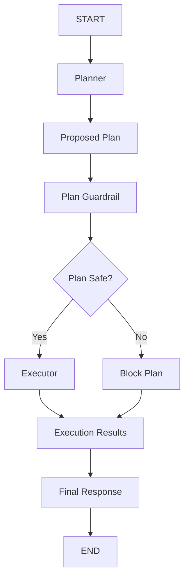

# Agent 07: Plan Guardrail

## Scenario

A user gives the agent a goal.

For example:

```text
Please refund $300 for invoice INV 1001
and notify the customer.
```

The planner decides what actions are needed.

It may create:

```text
Step 1
Look up the invoice

Step 2
Issue the refund

Step 3
Notify the customer
```

Before any step runs, the complete plan is checked.

## What This Agent Teaches

This agent introduces:

1. Planner Executor pattern
2. Structured planning
3. Plan guardrails
4. Multi step actions
5. Sequence validation
6. Tool validation
7. Tool argument validation
8. Whole plan safety

## Guardrail Type

This is a **Plan Guardrail**.

It is also an action guardrail at a higher level.

Instead of checking one tool call, it checks the full sequence of actions.

```text
User
  |
  v
Planner
  |
  v
Proposed Plan
  |
  v
Plan Guardrail
  |
  +---- Safe ------> Executor
  |
  +---- Unsafe ----> Block
```

## Main Idea

The planner creates the plan.

The guardrail validates the plan.

The executor runs the plan only after approval.

```text
Planner plans

Guardrail validates

Executor executes
```

## Main Flow



## Planner

The planner receives the user goal.

Example:

```text
Refund $300 for INV 1001
and notify the customer.
```

The planner may create:

```text
1. lookup_invoice

2. issue_refund

3. send_notification
```

The planner does not execute anything.

Its job is only to create the next set of actions.

## Example Plan

```text
Step 1

lookup_invoice

invoice_id = INV 1001
```

```text
Step 2

issue_refund

invoice_id = INV 1001

amount = 300
```

```text
Step 3

send_notification

message = Refund completed
```

At this point, nothing has executed.

## Structured Output

The planner returns a structured plan.

For example:

```python
[
    {
        "tool": "lookup_invoice",
        "arguments": {
            "invoice_id": "INV-1001"
        }
    },
    {
        "tool": "issue_refund",
        "arguments": {
            "invoice_id": "INV-1001",
            "amount": 300
        }
    },
    {
        "tool": "send_notification",
        "arguments": {
            "message": "Refund completed"
        }
    }
]
```

Structured output makes the plan easier to validate.

## Plan Guardrail

The plan guardrail reviews the complete plan.

It checks:

1. Are all tools allowed
2. Are required arguments present
3. Are unexpected arguments present
4. Is the refund amount valid
5. Is the refund above the limit
6. Are there multiple refunds
7. Is the plan too large
8. Is the order of actions correct

## Allowed Tools

The current allowed tools are:

```text
lookup_invoice

issue_refund

send_notification
```

If the planner creates something like:

```text
delete_customer
```

the complete plan is rejected.

## Tool Argument Validation

Each tool has its own expected arguments.

### lookup_invoice

Expected:

```python
{
    "invoice_id": "INV-1001"
}
```

### issue_refund

Expected:

```python
{
    "invoice_id": "INV-1001",
    "amount": 300
}
```

### send_notification

Expected:

```python
{
    "message": "Refund completed"
}
```

Unexpected arguments are rejected.

For example:

```python
{
    "invoice_id": "INV-1001",
    "message": "Refund completed"
}
```

would be invalid for `send_notification`.

This protects the executor from bad planner output.

## Refund Amount

For learning, the current rule is:

```text
Refund <= $500
Allowed

Refund > $500
Blocked
```

Example:

```text
issue_refund
amount = 300
```

passes.

But:

```text
issue_refund
amount = 900
```

fails.

## Multiple Refunds

The guardrail also checks the complete plan.

For example:

```text
issue_refund $200

issue_refund $200
```

Each refund may look safe by itself.

But the complete plan contains more than one refund action.

The plan is rejected.

## Sequence Validation

The invoice should be checked before the refund.

Correct:

```text
lookup_invoice
      |
      v
issue_refund
```

Incorrect:

```text
issue_refund
      |
      v
lookup_invoice
```

The incorrect sequence is blocked.

## Executor

The executor runs only after the plan passes all checks.

```text
PLAN SAFE
   |
   v
Executor
```

The executor performs the actions in order.

```text
lookup_invoice

issue_refund

send_notification
```

## Block Plan

If the plan fails any guardrail check, nothing executes.

For example:

```text
Plan contains refund of $900
```

Result:

```text
BLOCK ENTIRE PLAN
```

Even the first action does not run.

The complete plan is validated before execution starts.

## Example 1: Safe Plan

User:

```text
Refund $300 for INV 1001
and notify the customer.
```

Planner:

```text
lookup_invoice

issue_refund $300

send_notification
```

Guardrail:

```text
PASS
```

Flow:

```text
Planner
   |
   v
Plan
   |
   v
Plan Guardrail
   |
   v
SAFE
   |
   v
Executor
```

## Example 2: Unsafe Amount

User:

```text
Refund $900 for INV 1001
and notify the customer.
```

Planner:

```text
lookup_invoice

issue_refund $900

send_notification
```

Guardrail detects:

```text
Refund above $500
```

Result:

```text
BLOCK
```

Nothing executes.

## Example 3: Unsafe Sequence

The planner creates:

```text
issue_refund $300

lookup_invoice
```

The refund amount is allowed.

But the order is wrong.

Result:

```text
BLOCK
```

This shows that safety is not only about values.

The order of actions also matters.

## Example 4: Invalid Tool Arguments

The planner creates:

```python
{
    "tool": "send_notification",
    "arguments": {
        "invoice_id": "INV-1001",
        "message": "Refund completed"
    }
}
```

The `send_notification` tool expects only:

```python
{
    "message": "Refund completed"
}
```

The guardrail detects the extra argument.

Result:

```text
BLOCK
```

This prevents bad planner output from reaching the executor.

## Planner Executor Pattern

A ReAct style agent usually works like this:

```text
Think
  |
  v
Act
  |
  v
Observe
  |
  v
Think Again
```

Planner Executor works differently.

```text
Understand Goal
     |
     v
Create Plan
     |
     v
Validate Plan
     |
     v
Execute Plan
```

Agent 07 uses the simpler version:

```text
Plan Once

Validate Once

Execute
```

## Difference From Agent 02

Agent 02 asks:

```text
Is this individual tool call safe?
```

Agent 07 asks:

```text
Is this complete sequence of actions safe?
```

That is the main difference.

## Important Design Rule

The planner does not authorize itself.

Claude may create the plan.

That does not mean the plan should automatically run.

The safer pattern is:

```text
Model proposes plan
       |
       v
Guardrail validates plan
       |
       v
System executes plan
```

## Current Limitation

The current planner creates the plan once.

It does not replan.

A more advanced system could do this:

```text
Planner
   |
   v
Plan
   |
   v
Execute Step
   |
   v
Unexpected Result
   |
   v
Replanner
   |
   v
Updated Plan
```

We are intentionally not adding that yet.

The goal here is to understand the core Planner Executor pattern.

## What We Learned

From the agent side:

```text
Planner

Structured output

Executor

Multi step workflow
```

From the guardrail side:

```text
Plan validation

Tool validation

Argument validation

Sequence validation

Combination risk

Whole plan safety
```

## Main Learning

Several actions may look safe individually but become unsafe when viewed together.

```text
Safe Actions
do not always mean
Safe Plan
```

## Evolution So Far

Agent 01:

```text
Protect model input
```

Agent 02:

```text
Protect one tool action
```

Agent 03:

```text
Route actions by risk
```

Agent 04:

```text
Require human approval
```

Agent 05:

```text
Protect memory
```

Agent 06:

```text
Protect retrieved context
```

Agent 07:

```text
Protect the complete action plan
```

## Next Step

Agent 08 introduces:

**Output Guardrails**

The main question becomes:

```text
Claude created a response.

Should that response be allowed to reach the user?
```