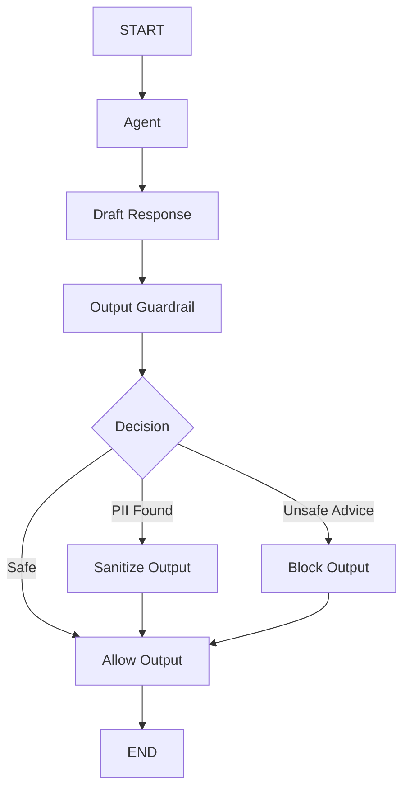

# Agent 08: Output Guardrail

## Scenario

Claude creates a response for the user.

But the response should not always be returned immediately.

The response may contain:

1. Sensitive information
2. Unsafe financial advice

This agent checks the draft response before the user sees it.

## What This Agent Teaches

This agent introduces:

1. Output guardrails
2. Final response validation
3. PII leakage detection
4. Financial advice checks
5. Output sanitization
6. Output blocking
7. Safe response delivery

## Guardrail Type

This is an **Output Guardrail**.

It protects what leaves the model.

```text
User
  |
  v
Agent
  |
  v
Draft Response
  |
  v
Output Guardrail
  |
  v
Final Response
  |
  v
User
```

## Main Idea

Claude can generate a draft.

The guardrail decides whether that draft can be returned.

The possible decisions are:

```text
ALLOW

SANITIZE

BLOCK
```

## Main Flow



## Example 1: Safe Output

Claude creates:

```text
A diversified portfolio can reduce concentration risk.
```

The guardrail checks the response.

No sensitive information is found.

No unsafe financial advice is found.

Decision:

```text
ALLOW
```

The draft response becomes the final response.

## Example 2: PII Leakage

Claude creates:

```text
Your SSN is 123-45-6789.
```

The output guardrail detects:

```text
SSN
```

Decision:

```text
SANITIZE
```

The final response becomes:

```text
Your SSN is [REDACTED_SSN].
```

The sensitive value does not reach the user.

## Example 3: Unsafe Financial Advice

Claude creates:

```text
You should put all your retirement savings into one technology stock.
```

The guardrail detects risky financial advice.

Decision:

```text
BLOCK
```

The original draft is not returned.

Instead, the system returns a safer response such as:

```text
I cannot make that investment decision for you.

I can explain the risks, options, and factors you may want to consider.
```

## State

The state contains:

```python
class AgentState(TypedDict):

    user_input: str

    draft_response: str

    output_decision: str

    guardrail_reason: str

    pii_types: list[str]

    final_response: str
```

## Agent Node

The agent node sends the user request to Claude.

Claude generates:

```text
draft_response
```

The important point is:

```text
Draft Response
does not mean
Final Response
```

The response still has to pass the output guardrail.

## Output Guardrail Node

The output guardrail checks the draft response.

It looks for:

1. PII
2. Risky financial advice

The guardrail then returns:

```text
allow

sanitize

block
```

## Allow Output

If the response is safe:

```text
Draft Response
      |
      v
ALLOW
      |
      v
Final Response
```

No changes are made.

## Sanitize Output

If PII is detected:

```text
Draft Response
      |
      v
PII Detected
      |
      v
SANITIZE
      |
      v
Final Response
```

For example:

```text
123-45-6789
```

becomes:

```text
[REDACTED_SSN]
```

## Block Output

If the response violates the financial policy:

```text
Draft Response
      |
      v
Unsafe Advice
      |
      v
BLOCK
      |
      v
Safe Replacement Response
```

The original draft never reaches the user.

## Why Output Guardrails Matter

Even if the input was safe, the model may still generate something unsafe.

For example:

```text
Sensitive data may appear in context

Retrieved documents may contain private data

The model may generate risky recommendations

The model may repeat information that should not be exposed
```

The final output therefore needs its own security boundary.

## Difference From Agent 01

Agent 01 protects what enters the model.

```text
User Input
    |
    v
Input Guardrail
    |
    v
Claude
```

Agent 08 protects what leaves the model.

```text
Claude
  |
  v
Output Guardrail
  |
  v
User
```

Together:

```text
Input Guardrail
      |
      v
    Claude
      |
      v
Output Guardrail
```

## Important Design Rule

The model should not be responsible for approving its own output.

Bad pattern:

```text
Claude creates answer

Claude decides answer is safe

Return answer
```

Better pattern:

```text
Claude creates answer

Independent guardrail checks answer

Application decides what to return
```

## Current Checks

The current output guardrail checks for:

```text
SSN

Credit card number

Risky financial advice
```

The current financial advice checks use simple patterns.

For example:

```text
put all your savings

invest all

guaranteed return

you should buy

you should sell
```

## Current Limitation

The current implementation uses simple regex rules.

A production system may combine:

```text
Rules

Classifier

Policy engine

Separate evaluator model

PII detector

Financial compliance checks
```

The current version is intentionally simple so the output security boundary is easy to understand.

## What We Learned

From the agent side:

```text
Draft response

State updates

Conditional routing

Final response handling
```

From the guardrail side:

```text
PII leakage detection

Output sanitization

Financial policy checks

Output blocking
```

## Main Learning

A model response should not automatically become a user response.

```text
Model Output
does not always mean
Approved Output
```

## Evolution So Far

Agent 01:

```text
Protect model input
```

Agent 02:

```text
Protect one tool action
```

Agent 03:

```text
Route actions by risk
```

Agent 04:

```text
Require human approval
```

Agent 05:

```text
Protect memory
```

Agent 06:

```text
Protect retrieved context
```

Agent 07:

```text
Protect the complete action plan
```

Agent 08:

```text
Protect the final response
```

## Next Step

Agent 09 introduces:

**Blast Radius Guardrail**

The main question becomes:

```text
Each action may be valid.

But what happens when many valid actions together
create a large financial impact?
```