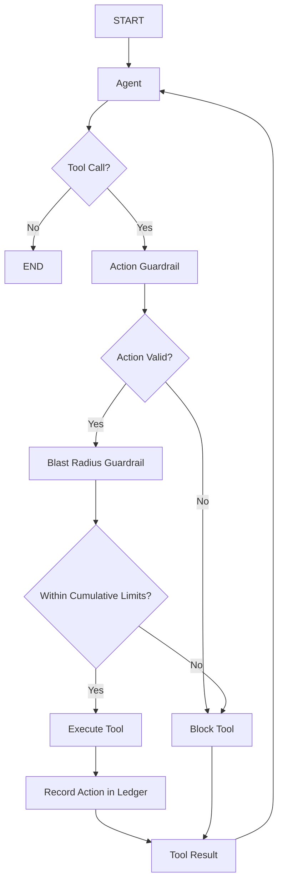

# Agent 09: Blast Radius Guardrail

## Scenario

An agent is allowed to issue refunds.

Each refund may be valid by itself.

For example:

```text
Refund 1 = $500
Refund 2 = $500
Refund 3 = $500
```

Each action is within the allowed single refund limit.

But many valid refunds together can create a large financial impact.

This agent tracks that cumulative impact.

## What This Agent Teaches

This agent introduces:

1. Blast radius guardrails
2. Cumulative risk
3. Historical action tracking
4. Per customer limits
5. Per agent limits
6. Hourly limits
7. Daily limits
8. Action frequency limits

## Guardrail Type

This is an **Action Guardrail**.

More specifically, it is a:

**Blast Radius Guardrail**

It checks the impact of the current action together with previous actions.

```text
User
  |
  v
Agent
  |
  v
Proposed Refund
  |
  v
Action Guardrail
  |
  v
Blast Radius Guardrail
  |
  +---- Within Limits ----> Execute
  |
  +---- Limit Exceeded ---> Block
```

## Main Idea

A single action can be safe.

Many safe actions together can become unsafe.

```text
One refund
SAFE

Many refunds
POSSIBLY UNSAFE
```

The blast radius guardrail looks at the bigger picture.

## Main Flow



## Example Limits

For learning, the current limits are:

```text
Single refund limit = $500

Customer daily limit = $1,000

Agent hourly limit = $2,000

Agent daily limit = $5,000

Maximum refunds per hour = 5
```

These are sample learning rules.

Real systems may use different limits.

## State

The state contains:

```python
class AgentState(TypedDict):

    messages: Annotated[
        list[AnyMessage],
        add_messages
    ]

    agent_id: str

    customer_id: str

    tool_name: str

    tool_args: dict

    action_allowed: bool

    action_reason: str

    blast_radius_allowed: bool

    blast_radius_reason: str
```

## Refund Ledger

The guardrail needs historical data.

For learning, the current version uses:

```python
REFUND_LEDGER = []
```

Each successful refund stores:

```text
agent_id

customer_id

invoice_id

amount

timestamp
```

Example:

```python
{
    "agent_id": "agent-001",
    "customer_id": "CUST-101",
    "invoice_id": "INV-1001",
    "amount": 500,
    "timestamp": ...
}
```

## Action Guardrail

The first guardrail checks the current refund by itself.

For example:

```text
Refund = $500
```

Single refund limit:

```text
$500
```

Result:

```text
PASS
```

If the amount is:

```text
$900
```

Result:

```text
BLOCK
```

The blast radius guardrail is not needed if the current action already fails.

## Blast Radius Guardrail

If the individual action passes, the blast radius guardrail checks history.

It asks:

```text
How much has this customer already received today?

How much has this agent refunded in the last hour?

How much has this agent refunded today?

How many refunds has this agent issued recently?
```

Then it calculates the projected totals if the new action is allowed.

## Example 1: First Refund

The agent issues:

```text
$500
```

There are no previous refunds.

Projected values:

```text
Customer daily total = $500

Agent hourly total = $500

Agent daily total = $500

Hourly refund count = 1
```

All limits pass.

Decision:

```text
ALLOW
```

The refund is executed and recorded in the ledger.

## Example 2: Second Refund

The same customer receives another:

```text
$500
```

Projected customer daily total:

```text
$500 + $500 = $1,000
```

Customer daily limit:

```text
$1,000
```

Decision:

```text
ALLOW
```

## Example 3: Third Refund

The same customer requests another:

```text
$500
```

Projected customer daily total:

```text
$1,000 + $500 = $1,500
```

Customer daily limit:

```text
$1,000
```

Decision:

```text
BLOCK
```

The current refund is valid by itself.

But the cumulative customer exposure is too high.

## Agent Level Example

Imagine the agent has issued:

```text
Customer A = $500

Customer B = $500

Customer C = $500

Customer D = $500
```

Total this hour:

```text
$2,000
```

The next refund is:

```text
$500
```

Projected hourly total:

```text
$2,500
```

Agent hourly limit:

```text
$2,000
```

Decision:

```text
BLOCK
```

This shows that blast radius can apply across many customers.

## Why History Matters

Without history, the guardrail sees only:

```text
Current refund = $500
```

That looks safe.

With history, the guardrail may see:

```text
Previous refunds = $4,500

Current refund = $500

Projected total = $5,000
```

The decision can therefore change.

## Important Design Rule

The system should evaluate the current action together with previous actions.

```text
Current Action
      |
      v
Historical Actions
      |
      v
Projected Exposure
      |
      v
Allow or Block
```

## Blast Radius Levels

A real system may track blast radius at many levels.

For example:

```text
One action

One customer

One agent

One hour

One day

One team

One business unit

Entire system
```

The larger the system, the more important cumulative limits become.

## Why This Is Different From Agent 02

Agent 02 asks:

```text
Is this refund safe by itself?
```

Agent 09 asks:

```text
Is this refund still safe when combined
with everything the agent has already done?
```

That is the main difference.

## Important Learning

A valid action can still be unsafe when repeated many times.

```text
Safe Action
+
Safe Action
+
Safe Action
+
Safe Action

can become

Unsafe Total Impact
```

## Current Limitation

The current ledger is an in memory Python list.

That means the history is lost when the application stops.

In a real system, the ledger may be stored in:

```text
PostgreSQL

DynamoDB

Redis

Event Store

Audit Database
```

The guardrail concept stays the same.

## What We Learned

From the agent side:

```text
Tool calling

State

Conditional routing

Action history
```

From the guardrail side:

```text
Cumulative risk

Historical checks

Projected exposure

Customer limits

Agent limits

Time based limits

Frequency limits
```

## Main Learning

The blast radius guardrail protects against repeated actions that are individually valid but collectively dangerous.

```text
One Action
may be safe

Cumulative Impact
may not be safe
```

## Evolution So Far

Agent 01:

```text
Protect model input
```

Agent 02:

```text
Protect one tool action
```

Agent 03:

```text
Route actions by risk
```

Agent 04:

```text
Require human approval
```

Agent 05:

```text
Protect memory
```

Agent 06:

```text
Protect retrieved context
```

Agent 07:

```text
Protect the full action plan
```

Agent 08:

```text
Protect the final response
```

Agent 09:

```text
Protect cumulative agent impact
```

## Final Learning

Together, these agents demonstrate guardrails across almost the full agent lifecycle.

```text
Input
  |
  v
Agent
  |
  v
Retrieval
  |
  v
Plan
  |
  v
Action
  |
  v
Human Approval
  |
  v
Memory
  |
  v
Output
  |
  v
Blast Radius
```

The main principle across the repository is:

```text
Model proposes

Guardrail decides

System executes
```